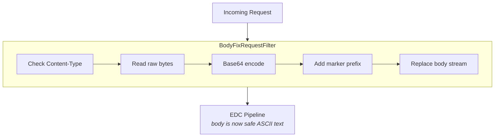
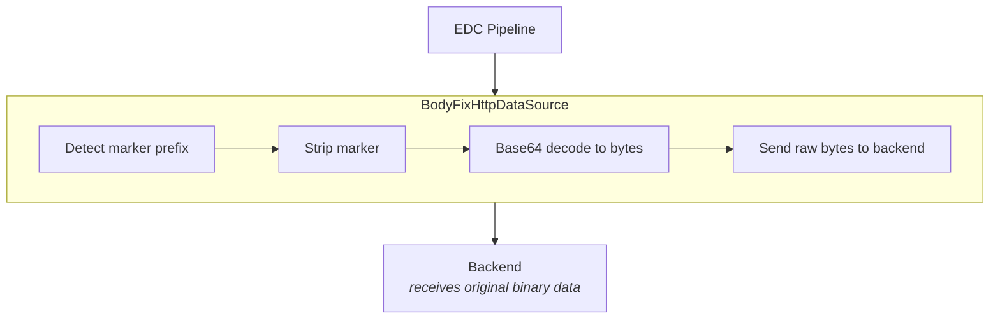
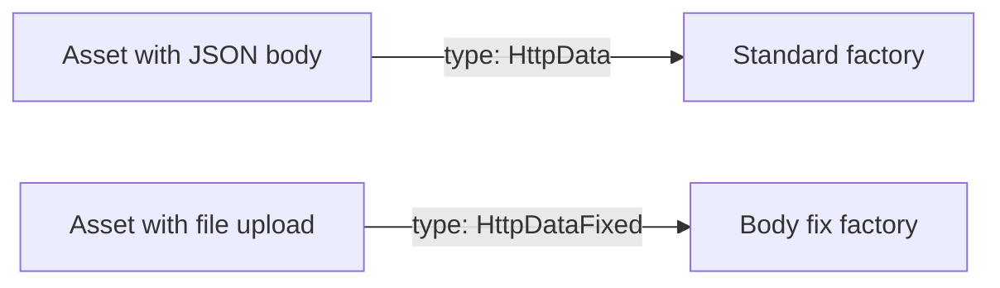

# Data Plane Body Fix Extension

An EDC extension that preserves binary request bodies during data plane proxying.

## The Problem

When the EDC Data Plane proxies HTTP requests to backend services, it corrupts binary payloads. This affects:

- **Multipart form uploads** (`multipart/form-data`) — file uploads fail with parsing errors
- **Binary streams** (`application/octet-stream`) — data integrity is compromised
- **Any non-text content** — images, archives, audio, video

### What Goes Wrong

The corruption happens because EDC's internal pipeline converts request bodies to Java `String` objects. This conversion assumes the body is text (UTF-8), but binary data contains arbitrary byte sequences that don't map cleanly to text characters.

For multipart requests specifically, the problem is subtle but fatal: multipart boundaries use CRLF sequences (`\r\n`) that get mangled during the String conversion, causing the receiving server to reject the request with errors like "unexpected end of form" or "invalid boundary."

### A Concrete Example

```
Original bytes:    [0x0D, 0x0A, 0x2D, 0x2D, 0x62, 0x6F, ...]  (CRLF + "--bo...")
After String conv: [0xEF, 0xBF, 0xBD, 0x0A, 0x2D, ...]        (corrupted)
```

The backend receives malformed data and rejects the request.

## Why This Is Hard to Fix

### Constraint 1: No EDC Fork

We cannot modify EDC's source code. The fix must work as a plugin that can be added to any EDC runtime without changes to the core framework.

### Constraint 2: The Corruption Happens Deep Inside EDC

The String conversion occurs in EDC's internal `ContainerRequestContextApiImpl.body()` method, which is called before any extension code runs in the normal data flow. By the time the HTTP pipeline gets the body, it's already corrupted.

### Constraint 3: Headers Don't Survive the Pipeline

A natural approach would be to mark requests with a custom header indicating they need special handling. However, EDC's `DataFlowStartMessage` (the object that travels through the pipeline) doesn't carry the original HTTP headers. Custom headers set on the incoming request are lost.

### Constraint 4: Factory Selection Is First-Come-First-Served

EDC's `PipelineService` selects which factory handles a request based on a `supportedType()` method. The built-in HTTP factory registers first and claims all `HttpData` types. A custom factory with the same type would never be selected.

## The Solution

We use a two-phase encoding/decoding strategy that works entirely within extension boundaries.

### Phase 1: Encode (Request Filter)

A JAX-RS filter intercepts requests at the public API layer, *before* EDC's body extraction:



The filter converts binary data like this:

```
Original:  [binary bytes...]
Encoded:   __EDC_B64:SGVsbG8gV29ybGQ=
```

Base64 encoding produces pure ASCII text that survives any String conversion unscathed.

### Phase 2: Decode (Custom Data Source)

A custom `DataSourceFactory` with a different type identifier (`HttpDataFixed` instead of `HttpData`) handles the outbound request:



### Routing Requests to the Custom Factory

The key insight is using a different data address *type*. When assets are created, binary content types get the `HttpDataFixed` type instead of the standard `HttpData`:



This avoids any conflict with EDC's built-in factory.

## Design Decisions

### Why Base64?

Base64 is a well-understood encoding that:
- Produces pure ASCII output (immune to charset issues)
- Is reversible without data loss
- Has fast, built-in implementations in every language
- Adds predictable overhead (~33%)

The overhead is acceptable per our requirements, and the simplicity beats alternatives like hex encoding (100% overhead) or custom binary-safe escaping schemes.

### Why a Marker Prefix?

The marker (`__EDC_B64:`) serves two purposes:

1. **Detection**: The decode phase can reliably identify encoded bodies
2. **Safety**: Non-encoded requests pass through unchanged

Without the marker, we'd need to guess whether a body is encoded, risking corruption in edge cases.

### Why Not Use Headers?

As mentioned, headers don't survive EDC's pipeline. We considered:
- Custom headers (lost in `DataFlowStartMessage`)
- Query parameters (visible in logs, affects caching)
- Separate metadata channel (adds complexity)

The in-band marker is self-contained and travels with the data.

### Why a Separate Data Address Type?

EDC's factory selection uses `supportedType()` as the primary discriminator. By using `HttpDataFixed`:

- We avoid racing with the built-in factory
- Selection is deterministic (type match, not registration order)
- Standard HTTP requests are unaffected

## Configuration

| Setting                              | Default                                        | Description                               |
| ------------------------------------ | ---------------------------------------------- | ----------------------------------------- |
| `edc.dataplane.bodyfix.enabled`      | `true`                                         | Enable/disable the extension              |
| `edc.dataplane.bodyfix.contentTypes` | `multipart/form-data,application/octet-stream` | Content types to encode (comma-separated) |
| `edc.dataplane.bodyfix.marker`       | `__EDC_B64:`                                   | Prefix marker for encoded bodies          |
| `eu.datacellar.openapi.force.httpdatafixed` | `false`                                 | Temporary override: force `HttpDataFixed` for any OpenAPI operation with a requestBody (diagnostics) |

## Asset Type Selection (OpenAPI Connector Integration)

Binary operations are intended to use `HttpDataFixed` so the BodyFix factory is selected.

> [!IMPORTANT]
> `HttpDataAddress.Builder.build()` always resets the type to `HttpData`.
> To persist `HttpDataFixed`, set the type **after** calling `build()`, e.g.:
> ```
> var dataAddress = HttpDataAddress.Builder.newInstance()
>     // ... set fields
>     .build();
> dataAddress.setType("HttpDataFixed");
> ```

## Limitations

1. **Memory overhead**: Bodies are loaded entirely into memory for encoding/decoding. Very large uploads may cause memory pressure.

2. **No streaming**: The encoding process requires reading the complete body before forwarding. True streaming isn't possible with this approach.

3. **33% size increase**: Base64 encoding increases payload size. For a 100MB file, the encoded form is ~133MB.

4. **Requires asset configuration**: Assets must use the `HttpDataFixed` type to benefit from this fix. Existing assets with `HttpData` type are unaffected (and still broken for binary content).

## How It Integrates

The extension is automatically loaded via the standard EDC ServiceExtension mechanism. It:

1. Registers the request filter on the `public` web context
2. Registers the custom data source factory with the pipeline service
3. Uses the shared `HttpRequestParamsProvider` so other extensions' decorators still apply

No code changes are needed in consuming applications beyond ensuring binary assets use the correct type.
